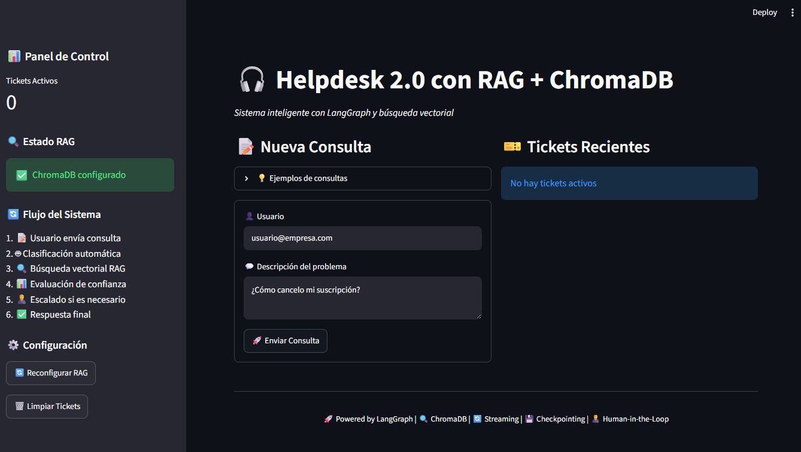
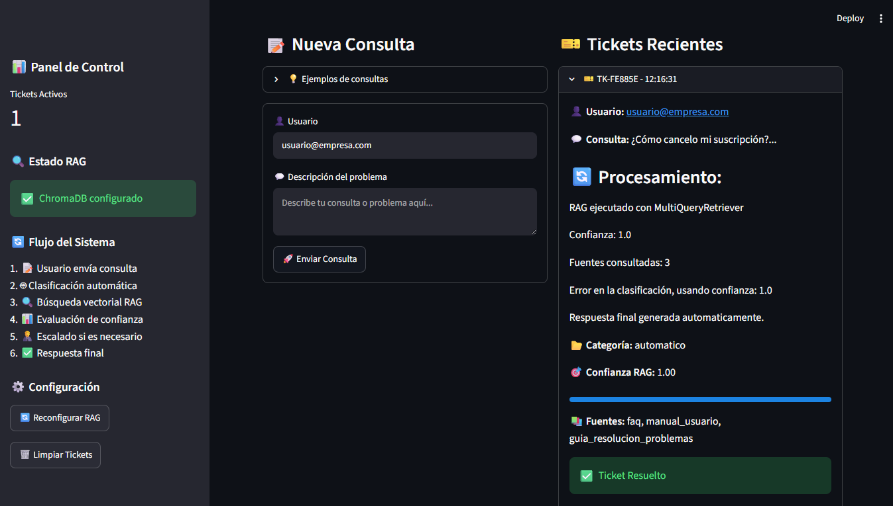
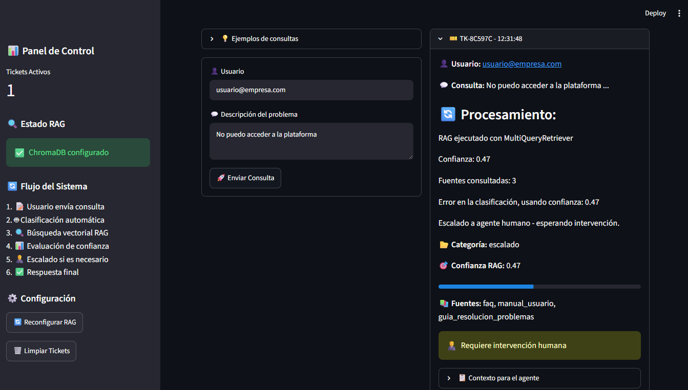
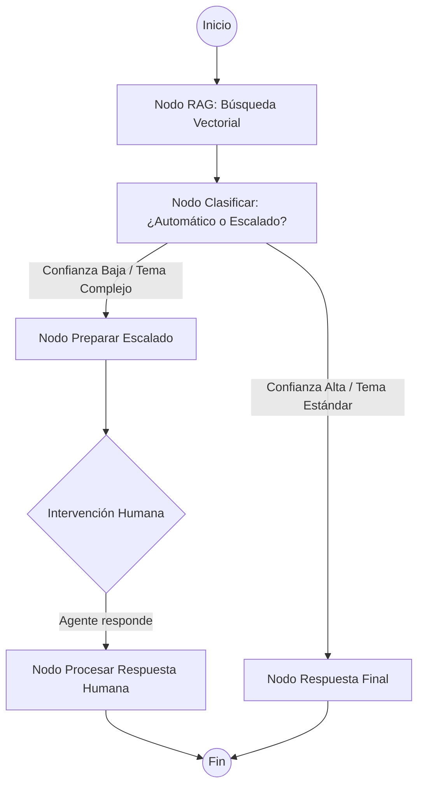

# 🎧 Helpdesk 2.0 con RAG + ChromaDB

Un sistema inteligente de atención al cliente que combina la potencia de **LangGraph**, la búsqueda semántica de **ChromaDB** y la capacidad de razonamiento de **Google Gemini**. El sistema automatiza la resolución de tickets técnicos mediante RAG (Retrieval Augmented Generation) y permite la intervención humana (Human-in-the-Loop) para casos complejos.

## 🌟 Características Principales

- **RAG Avanzado**: Utiliza `MultiQueryRetriever` para generar múltiples variantes de la consulta del usuario, mejorando la precisión de la recuperación de documentos.
- **Orquestación con LangGraph**: Implementación de un grafo de estados para controlar el flujo de clasificación, recuperación y respuesta.
- **Human-in-the-Loop (HITL)**: Capacidad de pausar la ejecución del grafo y esperar la respuesta de un agente humano cuando la confianza de la IA es baja.
- **Persistencia de Estado**: Uso de `SqliteSaver` para mantener el historial de tickets y el estado del grafo entre sesiones.
- **Interfaz Intuitiva**: Dashboard desarrollado en Streamlit con streaming de procesamiento y seguimiento de tickets en tiempo real.
- **Base de Conocimientos Vectorial**: Almacenamiento y búsqueda eficiente de documentos técnicos utilizando ChromaDB y embeddings de Google.

## 📁 Estructura del Proyecto

```text
langchain-helpdesk-system/
├── app.py                # Interfaz de usuario con Streamlit y lógica de sesión
├── graph.py              # Definición del flujo de LangGraph (Nodos, Bordes y Estado)
├── rag_system.py          # Lógica de búsqueda RAG, MultiQuery y generación de respuesta
├── setup_rag.py          # Procesador de documentos y configuración inicial de ChromaDB
├── config.py             # Variables de configuración y constantes del sistema
├── docs/                 # Base de conocimientos en archivos .md
├── chroma_db/             # Almacenamiento local de vectores de ChromaDB
├── helpdesk.db           # Base de datos SQLite para el checkpointer de LangGraph
└── REVIEW.md             # Guía de estudio y auditoría técnica para entrevistas de nivel Senior/Mid
```

## 📸 Capturas de Pantalla

- **Dashboard Principal**: Vista general de la interfaz de usuario en Streamlit.

- **Resolución Automática**: Ejemplo de una consulta técnica resuelta exitosamente por la IA.

- **Escalado a Humano**: Ejemplo de un caso complejo donde el sistema solicita intervención humana (HITL).



## 🛠️ Flujo de Trabajo Lógico



### Descripción del Flujo:
1. **RAG**: El sistema recibe la consulta y busca la información más relevante en la base de conocimientos usando múltiples versiones de la pregunta.
2. **Clasificación**: La IA analiza si la información recuperada es suficiente y confiable para responder automáticamente.
3. **Decisión**: 
   - Si es **Automático**: Genera la respuesta final basada en el contexto y cierra el ticket.
   - Si es **Escalado**: El sistema pausa el flujo y notifica que requiere un humano.
4. **Intervención**: Un agente humano escribe la respuesta, el grafo se reanuda y procesa la salida final.

## 🚀 Requisitos e Instalación

### 1. Clonar el repositorio e instalar dependencias
Asegúrate de tener Python 3.10+ instalado.

### 2. Configurar Entorno Virtual (Recomendado)
```bash
python -m venv venv
# Activar en Windows:
.\venv\Scripts\activate
# Activar en Linux/Mac:
source venv/bin/activate
```

### 3. Instalar Dependencias
```bash
pip install -r requirements.txt
```

### 4. Configurar Variables de Entorno
Crea un archivo `.env` o configura tu variable de entorno global:
```bash
GOOGLE_API_KEY=tu_api_key_de_google
```

## 🏃‍♂️ Ejecución en Local

Para iniciar el sistema, ejecuta:
```bash
streamlit run app.py
```

**Nota:** Al iniciar por primera vez, haz clic en el botón **"🚀 Configurar RAG"** en la barra lateral para procesar los documentos de la carpeta `docs/` y crear la base de datos de vectores.

## Configuración (`config.py`)

Puedes ajustar el comportamiento del sistema en `config.py`:
- **Modelos**: Cambiar el modelo de chat (`gemini-3.1-flash-lite`) o de embeddings (`models/gemini-embedding-001`).
- **RAG**: Ajustar el número de documentos recuperados (`k`) o el umbral de confianza.
- **Rutas**: Cambiar la ubicación de la base de datos Chroma o la carpeta de documentos.

## 🔄 Cambios Recientes

- **Migración de LLM**: Cambio completo de OpenAI $\rightarrow$ Google Gemini para reducir costos y mejorar la integración.
- **Optimización de Importaciones**: Actualización a `langchain_text_splitters` y `langchain_classic` para compatibilidad con versiones recientes de LangChain.
- **Persistencia**: Implementación de `langgraph-checkpoint-sqlite` para soporte de Human-in-the-Loop.

## 📈 Propuestas de Mejora

- [ ] **Soporte Multiformato**: Integrar cargadores para archivos PDF y DOCX.
- [ ] **Evaluación de RAG**: Implementar métricas de fidelidad y relevancia (RAGAS).
- [ ] **Multiactores**: Añadir agentes especializados en diferentes categorías de soporte.
- [ ] **Feedback del Usuario**: Permitir que el usuario califique la respuesta para re-entrenar el sistema.
