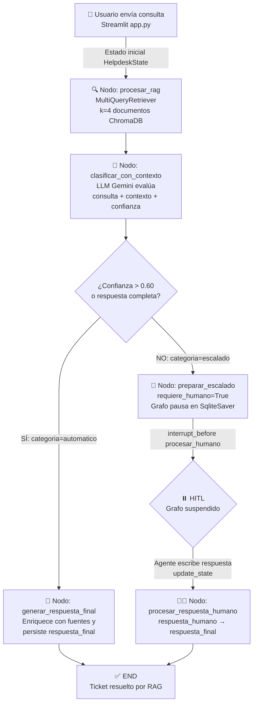

# 📄 Guía de Repaso y Preparación para Entrevistas: Helpdesk 2.0 con RAG + LangGraph

---

## 🎯 1. Problemas Resueltos y Valor de Negocio

### Problema Técnico
Los sistemas de helpdesk tradicionales (basados en reglas rígidas, árboles de decisión o búsqueda por palabras clave exactas) presentan tres fallos críticos:

1. **Cobertura semántica nula**: una consulta como *"la app se traba"* no coincide con el documento que dice *"rendimiento lento de la aplicación"* aunque sean el mismo problema.
2. **Cuello de botella humano**: todo ticket no resuelto automáticamente escala a un agente, sin distinguir entre tickets sencillos y casos que *verdaderamente* requieren intervención.
3. **Pérdida de contexto**: cada ticket comienza desde cero; no existe persistencia del estado de conversación entre sesiones.

### Solución y Valor de Negocio
Este sistema combina tres tecnologías para eliminar esos cuellos de botella:

| Dolor del sistema | Tecnología aplicada | Ventaja concreta |
|---|---|---|
| Búsqueda literal ineficaz | ChromaDB + Embeddings Gemini | Recuperación semántica: entiende *intención*, no solo palabras |
| Sin triaje inteligente | LangGraph + LLM Gemini | El grafo decide automáticamente si responder o escalar |
| Estado perdido entre sesiones | SqliteSaver (checkpointer) | El ticket puede pausarse y reanudarse con contexto completo |
| Sobrecarga de agentes humanos | RAG + MultiQueryRetriever | Reduce tickets escalados priorizando la resolución automática |

**Frente a enfoques tradicionales** (chatbots con intents, JIRA automático, scripts IF/ELSE), este sistema escala dinámicamente con el tamaño de la base de conocimientos sin reentrenamiento, ya que agrega documentos Markdown directamente al vectorstore.

---

## 🏗️ 2. Arquitectura de la Solución

### Patrón de Arquitectura
**Event-Driven Stateful Graph** (Grafo de estados dirigido por eventos), implementado con **LangGraph**.

**Justificación:** Un flujo de helpdesk no es lineal. Puede pausarse esperando un humano, bifurcarse según la confianza de la IA, y reanudarse semihoras después en el mismo estado exacto. Un grafo de nodos y bordes condicionales modela esto de forma natural, mientras que una arquitectura MVC o REST pura haría el control de flujo frágil e imperativo.

---

### Desglose de Capas

| Módulo | Rol |
|---|---|
| `config.py` | Capa de configuración: rutas, modelos y constantes globales |
| `setup_rag.py` | Capa de ingesta: carga documentos `.md`, los chunkea y los persiste en ChromaDB |
| `rag_system.py` | Capa de recuperación: `VectorRAGSystem` ejecuta el `MultiQueryRetriever`, calcula confianza y genera respuesta |
| `graph.py` | Capa de orquestación: define `HelpdeskState`, los 5 nodos del grafo y la lógica de enrutamiento condicional |
| `app.py` | Capa de presentación: interfaz Streamlit con streaming, gestión de tickets y panel HITL |
| `docs/` | Base de conocimientos: archivos Markdown (`faq.md`, `manual_usuario.md`, `guia_resolucion_problemas.md`) |
| `chroma_db/` | Almacén vectorial persistido localmente |
| `helpdesk.db` | Estado del grafo persistido en SQLite (checkpointer LangGraph) |

---

### Flujo de Trabajo Lógico (Mermaid)



---

### Descripción del Flujo (paso a paso)

1. **Ingesta (Setup):** `DocumentProcessor` en `setup_rag.py` carga los `.md` de `docs/`, los divide en chunks de 1000 chars con 200 de overlap usando `RecursiveCharacterTextSplitter`, y los persiste en ChromaDB con embeddings `gemini-embedding-001`. Se enriquecen metadatos (`doc_type`, `chunk_id`, `doc_id` por MD5).

2. **Inicio de ticket (`app.py`):** El usuario envía una consulta desde el formulario Streamlit. Se genera un `ticket_id` (`uuid4`) y se construye el `HelpdeskState` inicial. La configuración `{"thread_id": ticket_id}` vincula el estado al checkpointer SQLite.

3. **Nodo RAG (`graph.py → rag_system.py`):** `VectorRAGSystem.buscar()` invoca el `MultiQueryRetriever`, que genera **3 variantes semánticas** de la consulta con el LLM y las lanza en paralelo al vectorstore. Se recuperan hasta `k=4` documentos por variante (deduplicados). Se calcula la confianza con un score de coincidencia de palabras clave + bonuses por cantidad de docs y longitud de contenido.

4. **Nodo Clasificar (`graph.py`):** El LLM recibe la consulta original, el contexto RAG y el score de confianza. Responde con `"automatico"` o `"escalado"` con justificación. Si la respuesta del LLM es ambigua, el fallback usa el umbral `confianza >= 0.60`.

5. **Bifurcación (borde condicional):** `decidir_desde_clasificacion()` enruta hacia `respuesta_final` o `escalado`.

6. **Camino automático:** `generar_respuesta_final()` toma `respuesta_rag` y las `fuentes`, las concatena y escribe `respuesta_final` en el estado.

7. **Camino HITL:** `preparar_escalado()` marca `requiere_humano=True`. El grafo llega al edge de `escalado → procesar_humano` **pero el compilador tiene `interrupt_before=["procesar_humano"]`**, lo que pausa la ejecución y persiste el estado en `helpdesk.db`. La UI Streamlit detecta `requiere_humano=True && !respuesta_final` y muestra el formulario de respuesta humana.

8. **Reanudación HITL:** El agente escribe su respuesta y `app.py` llama a `update_state(config, {"respuesta_humano": ...})`, inyectando el valor en el estado persistido. Luego llama a `.stream(None, config=config)` (input `None` = continuar desde interrupción). El grafo reanuda desde `procesar_humano`.

9. **Streaming (`app.py`):** En cada iteración del grafo, `.stream(stream_mode="updates")` retorna dicts `{nodo: salida}`. La app extrae el `historial` de cada nodo para mostrar el progreso en tiempo real.

---

## 💼 3. Ficha para Portafolio & CV (Estructura STAR)

---

* **S (Situación):** Los equipos de soporte técnico dedican una fracción significativa de su capacidad a resolver tickets repetitivos que podrían resolverse con documentación existente, lo que genera tiempos de espera elevados y burnout en agentes.

* **T (Tarea):** Diseñar e implementar un sistema de helpdesk inteligente capaz de resolver automáticamente tickets técnicos estándar, con una ruta de escalado confiable hacia agentes humanos para casos complejos, manteniendo el contexto completo del ticket durante toda la conversación.

* **A (Acción):** Construí un sistema end-to-end en Python combinando **LangGraph** para la orquestación del flujo de trabajo con estado persistente, **ChromaDB** como base vectorial para búsqueda semántica, y **Google Gemini** como backbone de LLM y embeddings. Implementé `MultiQueryRetriever` para mejorar la recuperación de documentos mediante expansión semántica de la consulta, un clasificador LLM con fallback heurístico basado en score de confianza, y el patrón **Human-in-the-Loop** usando `interrupt_before` + `SqliteSaver` para pausar y reanudar el grafo sin pérdida de estado. La interfaz Streamlit expone streaming en tiempo real del procesamiento.

* **R (Resultado):** Sistema funcional con triaje automatizado que desvía tickets sencillos sin intervención humana, reduce el tiempo de resolución en casos documentados, y garantiza que los agentes humanos reciben el contexto RAG completo antes de responder. La arquitectura permite añadir nuevos documentos de conocimiento sin reentrenamiento ni cambios de código.

---

## 🧠 4. Fundamentos Teóricos e Implementación Crítica

### 4.1 RAG (Retrieval-Augmented Generation)
RAG es un patrón que desacopla el conocimiento estático del razonamiento del LLM. En lugar de meter toda la documentación en el contexto (costoso y limitado por ventana de tokens), el sistema primero **recupera** los fragmentos más relevantes y luego los provee como contexto al LLM para **generar** la respuesta. Esto elimina la alucinación porque el LLM responde únicamente con información recuperada del vectorstore.

### 4.2 Embeddings y Similitud Semántica Vectorial
Los embeddings (`gemini-embedding-001`) transforman texto en vectores de alta dimensión donde la **distancia coseno** mide la similitud semántica. Dos frases con distinto vocabulario pero igual significado quedan próximas en el espacio vectorial. ChromaDB ejecuta Approximate Nearest Neighbor (ANN) search para recuperar los `k` vectores más cercanos al embedding de la consulta en tiempo `O(log n)`.

### 4.3 MultiQueryRetriever y Expansión Semántica
Un único embedding de consulta puede no capturar todos los ángulos de un problema. `MultiQueryRetriever` usa el LLM para generar N variantes (en este caso 3) de la consulta original, lanza las búsquedas en paralelo y deduplica los resultados. Esto mejora el **recall** (encontrar más documentos relevantes) a costa de N llamadas adicionales al LLM para la expansión.

### 4.4 LangGraph: Grafos de Estado Persistentes
LangGraph modela el flujo como un DAG (Directed Acyclic Graph) de nodos (funciones Python) y edges (rutas de datos). El estado (`TypedDict`) fluye entre nodos; cada nodo lee del estado y retorna actualizaciones parciales. Los **bordes condicionales** permiten bifurcaciones dinámicas. La integración con un `Checkpointer` serializa el estado completo en cada paso, habilitando pausa/reanudación, time travel y tolerancia a fallos.

### 4.5 Human-in-the-Loop (HITL) con `interrupt_before`
El parámetro `interrupt_before=["procesar_humano"]` instruye al runtime de LangGraph a **suspender** la ejecución **antes** de entrar al nodo `procesar_humano`, persistir el estado en SQLite y retornar el control a la aplicación. La reanudación se activa con `.stream(None, config=config)`. `update_state()` inyecta valores externos directamente en el estado persistido sin reejecutar nodos anteriores.

---

## 📚 5. Fichas de Estudio Cornell-Kwik (Preparación para Entrevistas)

---

### 📑 LangGraph: StateGraph y Persistencia

| CLAVES / PREGUNTAS DE ENTREVISTA | NOTAS Y DETALLES TÉCNICOS (Respuesta Directa) |
| :--- | :--- |
| ¿Qué es y cuál es su principio base? | Framework sobre LangChain que modela flujos de IA como grafos de nodos con estado tipado (`TypedDict`). Principio: separación de lógica (nodos) y datos (estado). |
| Sintaxis o implementación patrón | `graph = StateGraph(HelpdeskState)` → `graph.add_node("rag", fn)` → `graph.add_conditional_edges(...)` → `compiled = graph.compile(checkpointer=SqliteSaver(conn))` |
| ¿Qué error común previene o resuelve? | Previene la pérdida de estado en flujos multi-paso. Sin checkpointer, un crash entre nodos pierde todo el contexto del ticket. Con `SqliteSaver`, el estado se recupera íntegro desde el último checkpoint. |
| Consideraciones de rendimiento/escalabilidad | Cada nodo serializa el estado completo a SQLite en cada paso. Para alta concurrencia, usar PostgreSQL como backend (`langgraph-checkpoint-postgres`). `check_same_thread=False` no escala horizontalmente. |

> **📌 RESUMEN DE IMPACTO:** LangGraph es la elección correcta cuando el flujo tiene bifurcaciones condicionales, necesita pausarse para input externo (humano o API), o debe ser auditable paso a paso. Un pipeline LCEL simple no cubre estos casos.

#### 🧠 Análisis Creativo (Kwik Brain Framework)

- **Create (Analogía Mental):** Es como un aeropuerto con control de tráfico aéreo. Cada avión (ticket) sigue un plan de vuelo (grafo), puede ser desviado a una pista alternativa (escalado), puede quedar en espera en el aire (HITL), y en cualquier momento la torre de control (checkpointer) sabe la posición exacta de cada avión.

- **Inquire (Duda Crítica):** *"Si el grafo usa `interrupt_before`, ¿cómo sabe LangGraph que debe reanudar ese ticket específico y no otro?"* → La clave es el `thread_id` en `config = {"configurable": {"thread_id": ticket_id}}`. El checkpointer indexa el estado por `thread_id`, permitiendo múltiples grafos concurrentes completamente aislados en el mismo proceso.

- **Apply (Prueba de Fuego con Código):**
```python
# Reanudar un grafo pausado por HITL
config = {"configurable": {"thread_id": "TK-A1B2C3"}}

# 1. Inyectar respuesta humana sin reejecutar nodos anteriores
app.update_state(config, {"respuesta_humano": "Reinicie el servidor de caché."})

# 2. Continuar desde el interrupt (input=None = no hay nuevo mensaje de usuario)
for chunk in app.stream(None, config=config, stream_mode="updates"):
    print(chunk)  # Emite {nodo: delta_estado} por cada nodo ejecutado
```

---

### 📑 RAG con MultiQueryRetriever

| CLAVES / PREGUNTAS DE ENTREVISTA | NOTAS Y DETALLES TÉCNICOS (Respuesta Directa) |
| :--- | :--- |
| ¿Qué es y cuál es su principio base? | Técnica que expande una consulta en N variantes usando un LLM, ejecuta búsquedas paralelas en el vectorstore y deduplica los resultados. Principio: maximizar el **recall** de la recuperación semántica. |
| Sintaxis o implementación patrón | `MultiQueryRetriever.from_llm(retriever=vs.as_retriever(search_kwargs={"k": 4}), llm=llm, prompt=custom_prompt)` → `retriever.invoke(consulta)` |
| ¿Qué error común previene o resuelve? | Previene el **"vocabulary mismatch"**: usuario escribe "no puedo entrar" pero la doc dice "autenticación fallida". Una sola búsqueda falla; las 3 variantes capturan el doc correcto. |
| Consideraciones de rendimiento/escalabilidad | Latencia = N × (tiempo de embedding + búsqueda ANN). Con N=3 y `k=4`, se evalúan hasta 12 documentos antes de deduplicar. Cuello de botella: llamada LLM para generar variantes. Alternativa más rápida: HyDE. |

> **📌 RESUMEN DE IMPACTO:** `MultiQueryRetriever` es la diferencia entre un chatbot que dice "no encontré nada" y uno que encuentra el documento correcto aunque el usuario no use las palabras exactas. La deduplicación por contenido es crítica para evitar contexto repetido al LLM generador.

#### 🧠 Análisis Creativo (Kwik Brain Framework)

- **Create (Analogía Mental):** Es como buscar en Google con un asistente que reformula tu búsqueda en 3 formas distintas: `"error wifi"`, `"no conecta internet"`, `"problema conexión red"`. Luego une todos los resultados y quita los duplicados, obteniendo más coverage que con una sola búsqueda.

- **Inquire (Duda Crítica):** *"Si hace 3 búsquedas con k=4 cada una, ¿pueden llegar 12 documentos al LLM de generación?"* → No necesariamente. LangChain deduplica por `page_content`. Además, en `buscar()` del proyecto solo se usan los **top 3** (`documentos[:3]`), limitando el tamaño del prompt.

- **Apply (Prueba de Fuego con Código):**
```python
# rag_system.py — el retriever genera variantes y deduplica automáticamente
documentos = self.retriever.invoke(consulta)  # Retorna lista deduplicada

# Solo top 3 documentos para mantener el contexto manejable
for i, doc in enumerate(documentos[:3]):
    contexto_partes.append(f"Documento {i+1}: {doc.page_content.strip()}")
    filename = doc.metadata.get('filename', f'doc_{i+1}')
    if filename not in fuentes:
        fuentes.append(filename)
```

---

### 📑 Human-in-the-Loop (HITL) con LangGraph

| CLAVES / PREGUNTAS DE ENTREVISTA | NOTAS Y DETALLES TÉCNICOS (Respuesta Directa) |
| :--- | :--- |
| ¿Qué es y cuál es su principio base? | Patrón donde el flujo de un agente se suspende para obtener validación o input humano, luego se reanuda con ese input. Principio: IA como asistente, humano como árbitro final en casos de baja confianza. |
| Sintaxis o implementación patrón | Compilar con `interrupt_before=["nodo_critico"]` → grafo pausa → `app.update_state(config, {...})` → `app.stream(None, config=config)` para reanudar |
| ¿Qué error común previene o resuelve? | Previene **hallucinations in production**: el sistema no inventa respuestas en casos donde no tiene información suficiente. En lugar de responder mal, escala y espera al humano. |
| Consideraciones de rendimiento/escalabilidad | El estado pausado ocupa espacio en SQLite indefinidamente. En producción, implementar TTL para tickets abandonados y limpieza periódica. Considerar `interrupt_after` si el nodo de interrupción tiene side-effects que deben revertirse. |

> **📌 RESUMEN DE IMPACTO:** HITL es lo que convierte un "chatbot" en un sistema de producción confiable. Un entrevistador espera que distingas entre `interrupt_before` (el nodo NO se ejecuta, el input humano puede cambiar el outcome) e `interrupt_after` (el nodo ya se ejecutó, el humano puede revisar y/o corregir).

#### 🧠 Análisis Creativo (Kwik Brain Framework)

- **Create (Analogía Mental):** Es como un quirófano con un cirujano asistente IA. El robot puede hacer la mayor parte de la operación automáticamente, pero antes de un corte crítico se pausa y el cirujano humano verifica y aprueba el siguiente paso. No actúa hasta recibir confirmación.

- **Inquire (Duda Crítica):** *"¿Qué pasa si el agente humano nunca responde? ¿El ticket queda bloqueado para siempre?"* → Sí, en la implementación actual no hay timeout. La solución robusta es un job de cleanup que detecte tickets con `requiere_humano=True` y `timestamp > N horas`, y los cierre o re-escale automáticamente.

- **Apply (Prueba de Fuego con Código):**
```python
# graph.py — la interrupción se declara en tiempo de compilación
compiled = self.graph.compile(
    checkpointer=checkpointer,
    interrupt_before=["procesar_humano"]  # Pausa ANTES de ejecutar este nodo
)

# app.py — agente inyecta su respuesta y el grafo continúa
st.session_state.helpdesk.update_state(
    config,
    {"respuesta_humano": respuesta_humano}  # Modifica el estado pausado
)
# stream(None) = reanudar desde el checkpoint sin nuevo input de usuario
for chunk in st.session_state.helpdesk.stream(None, config=config, stream_mode="updates"):
    ticket_data['historial'].extend(chunk.get("procesar_humano", {}).get("historial", []))
```

---

### 📑 ChromaDB: Vector Store y Embeddings

| CLAVES / PREGUNTAS DE ENTREVISTA | NOTAS Y DETALLES TÉCNICOS (Respuesta Directa) |
| :--- | :--- |
| ¿Qué es y cuál es su principio base? | Base de datos vectorial embebida (sin servidor). Almacena vectores de alta dimensión con metadatos y permite búsqueda ANN por similitud coseno o euclidiana. |
| Sintaxis o implementación patrón | `Chroma.from_documents(documents=chunks, embedding=embeddings, persist_directory="chroma_db", collection_name="helpdesk_knowledge")` |
| ¿Qué error común previene o resuelve? | Previene el "full rebuild on restart": si `chroma_db/` existe, `setup_rag_system(force_rebuild=False)` carga el vectorstore existente sin re-embeddear todos los documentos (costoso en tokens de API). |
| Consideraciones de rendimiento/escalabilidad | Ideal para prototipos y volúmenes pequeños (< 1M vectores). Para producción con alta concurrencia, migrar a Pinecone, Weaviate o pgvector. El 20% de chunk_overlap garantiza que ideas que "cruzan" fronteras de chunks sean recuperables. |

> **📌 RESUMEN DE IMPACTO:** La elección de `chunk_size` y `chunk_overlap` en `RecursiveCharacterTextSplitter` afecta directamente la calidad del RAG. Chunks muy pequeños pierden contexto; muy grandes saturan el prompt. 1000/200 es un balance sólido para documentación técnica.

#### 🧠 Análisis Creativo (Kwik Brain Framework)

- **Create (Analogía Mental):** ChromaDB es como una biblioteca con localización por aroma. En lugar de buscar por título, ponés una fragancia (embedding) y la biblioteca te lleva a los libros que huelen más parecido. La fragancia captura el "significado" del texto, no las palabras exactas.

- **Inquire (Duda Crítica):** *"¿Por qué `RecursiveCharacterTextSplitter` y no dividir por párrafos o número fijo de palabras?"* → Intenta dividir por separadores en orden de preferencia (`\n\n`, `\n`, `.`, `,`, ` `), priorizando divisiones naturales. Dividir por tamaño fijo puede cortar en medio de una oración, generando chunks sin semántica coherente que degradan la calidad del embedding.

- **Apply (Prueba de Fuego con Código):**
```python
# setup_rag.py — pipeline completo de ingesta
text_splitter = RecursiveCharacterTextSplitter(
    chunk_size=1000,
    chunk_overlap=200,          # 20% overlap para preservar contexto entre bordes
    separators=["\n\n", "\n", ".", "!", "?", ",", " ", ""]  # Jerarquía de corte
)
chunks = text_splitter.split_documents(documents)

# Enriquecer metadatos antes de indexar (crítico para filtrado posterior)
for i, chunk in enumerate(chunks):
    chunk.metadata.update({"chunk_id": i, "chunk_size": len(chunk.page_content)})

vectorstore = Chroma.from_documents(
    documents=chunks,
    embedding=GoogleGenerativeAIEmbeddings(model="models/gemini-embedding-001"),
    persist_directory="chroma_db",
    collection_name="helpdesk_knowledge"
)
```

---

### 📑 TypedDict, Annotated y Reducers en el Estado de LangGraph

| CLAVES / PREGUNTAS DE ENTREVISTA | NOTAS Y DETALLES TÉCNICOS (Respuesta Directa) |
| :--- | :--- |
| ¿Qué es y cuál es su principio base? | `TypedDict` define el esquema del estado. `Annotated[List[str], add]` aplica un **reducer**: en lugar de reemplazar la lista, la función `add` (del módulo `operator`) **concatena** los valores nuevos con los existentes. |
| Sintaxis o implementación patrón | `historial: Annotated[List[str], add]` — cada nodo retorna `{"historial": ["nuevo paso"]}` y LangGraph aplica `add(estado_actual, nuevo_valor)` automáticamente. |
| ¿Qué error común previene o resuelve? | Previene que un nodo sobrescriba el historial acumulado de nodos anteriores. Sin `Annotated[..., add]`, el último nodo que escriba `historial` borra todos los registros anteriores. |
| Consideraciones de rendimiento/escalabilidad | El reducer se ejecuta en cada actualización de estado. Para listas muy largas, considerar almacenar el historial en una DB externa referenciada por ID. |

> **📌 RESUMEN DE IMPACTO:** Los reducers hacen el estado **aditivo y no destructivo**. Para cualquier campo que acumule valores (mensajes, logs, pasos de razonamiento), `Annotated[List, add]` es la solución idiomática. Entender por qué `historial` usa `add` y `respuesta_final` no es un diferenciador clave en entrevistas de LangGraph.

#### 🧠 Análisis Creativo (Kwik Brain Framework)

- **Create (Analogía Mental):** Es como el sistema de auditoría de una empresa. Cada departamento (nodo) agrega sus entradas al log (`historial`) sin borrar las de los departamentos anteriores. Al final, el log completo tiene la traza de todos los que procesaron el ticket.

- **Inquire (Duda Crítica):** *"¿Qué pasaría si `respuesta_final` usara `Annotated[Optional[str], add]`?"* → `add` sobre strings hace **concatenación**: `"respuesta A" + "respuesta B"` = `"respuesta Arespuesta B"`. Para campos escalares que deben reemplazarse, se usa asignación directa (sin `Annotated`), que es el comportamiento por defecto: el valor nuevo **sobreescribe** el anterior.

- **Apply (Prueba de Fuego con Código):**
```python
# graph.py — diferencia semántica entre campos acumulativos y escalares
from typing import TypedDict, Optional, List, Annotated
from operator import add

class HelpdeskState(TypedDict):
    consulta: str                              # Escalar: no cambia
    confianza: float                           # Escalar: se sobreescribe
    respuesta_final: Optional[str]             # Escalar: último valor gana
    historial: Annotated[List[str], add]       # Lista: cada nodo ACUMULA entradas
```

---

## 🛠️ 6. Flujo de Desarrollo Recomendado (Blueprint)

### Paso 1 — Bootstrap del Entorno
```bash
mkdir helpdesk-rag && cd helpdesk-rag
python -m venv venv && source venv/bin/activate  # o .\venv\Scripts\activate en Windows

pip install langchain langchain-community langchain-google-genai \
            langchain-text-splitters langchain-classic \
            langgraph langgraph-checkpoint-sqlite \
            streamlit chromadb
pip freeze > requirements.txt
```

### Paso 2 — Configuración y Variables de Entorno
```python
# config.py — Centralizar TODAS las constantes
CHROMADB_PATH = "chroma_db"
DOCS_PATH = "docs"
EMBEDDINGS_MODEL = "models/gemini-embedding-001"
LLM_MODEL = "gemini-3.1-flash-lite"
CONFIDENCE_THRESHOLD = 0.60
RAG_K = 4  # Documentos a recuperar por búsqueda
```
```bash
# .env (no commitear)
GOOGLE_API_KEY=tu_api_key
```

### Paso 3 — Base de Conocimientos y Pipeline de Ingesta
1. Crear `docs/` con archivos `.md` (FAQs, manuales, guías de troubleshooting).
2. Implementar `DocumentProcessor` en `setup_rag.py`:
   - `load_documents()` con `DirectoryLoader` + metadatos enriquecidos (filename, doc_type, doc_id MD5)
   - `split_documents()` con `RecursiveCharacterTextSplitter(chunk_size=1000, chunk_overlap=200)`
   - `create_vectorstore()` con `Chroma.from_documents()`
3. Agregar `test_search()` para validar calidad del RAG antes de integrar.

### Paso 4 — Sistema RAG
1. Implementar `VectorRAGSystem.__init__()`: cargar vectorstore + crear `MultiQueryRetriever`.
2. Diseñar el prompt de expansión de consultas con instrucciones explícitas de generar N variantes.
3. Implementar `buscar()`: invoke → extraer top-K docs → generar respuesta con LLM.
4. Implementar `_calcular_confianza()`: score por coincidencia de palabras clave + bonus por volumen de docs.

### Paso 5 — Definición del Grafo
1. Definir `HelpdeskState` (`TypedDict`) con todos los campos. Usar `Annotated[List, add]` para campos acumulativos.
2. Implementar los 5 nodos como métodos: `procesar_rag`, `clasificar_con_contexto`, `preparar_escalado`, `procesar_respuesta_humano`, `generar_respuesta_final`.
3. Implementar funciones de enrutamiento: `decidir_desde_clasificacion`, `decidir_desde_humano`.
4. En `crear_grafo()`: `StateGraph` → `add_node` → `add_edge` → `add_conditional_edges`.
5. En `compilar()`: conectar `SqliteSaver` y definir `interrupt_before=["procesar_humano"]`.

### Paso 6 — Interfaz de Usuario
1. Inicializar `helpdesk` en `st.session_state` (singleton de sesión).
2. Implementar `procesar_consulta()` con `stream(stream_mode="updates")`.
3. UI: columna 1 (formulario nueva consulta), columna 2 (lista de tickets con estado).
4. Lógica HITL: detectar `requiere_humano=True && !respuesta_final` → mostrar área de texto → `update_state()` + `stream(None)`.
5. Footer con estadísticas de sesión.

### Paso 7 — Validación y Pruebas
```bash
# 1. Configurar el vectorstore inicial
python setup_rag.py

# 2. Ejecutar la aplicación
streamlit run app.py

# Pruebas manuales recomendadas:
# - Consulta con alta confianza → debe resolver automáticamente (RAG)
# - Consulta fuera de la base de conocimiento → debe escalar (HITL)
# - Flujo HITL completo: escalado → respuesta agente → resolución final
# - "Reconfigurar RAG" desde sidebar → re-indexar documentos
```

### Paso 8 — Mejoras para Producción
- [ ] Reemplazar ChromaDB local con **Pinecone** o **pgvector** para alta concurrencia
- [ ] Migrar checkpointer de SQLite a **PostgreSQL** (`langgraph-checkpoint-postgres`)
- [ ] Implementar evaluación de calidad RAG con **RAGAS** (faithfulness, answer relevance)
- [ ] Agregar soporte **PDF/DOCX** con `UnstructuredLoader` o `PyMuPDF`
- [ ] CI/CD con tests de regresión sobre el pipeline RAG (queries + respuestas esperadas)
- [ ] Agregar observabilidad con **LangSmith** (tracing de cada invocación del grafo)
- [ ] Implementar TTL para tickets HITL abandonados (cleanup job periódico)

---

*Última revisión: Agosto 2026 — Auditado contra el código fuente real del proyecto.*
